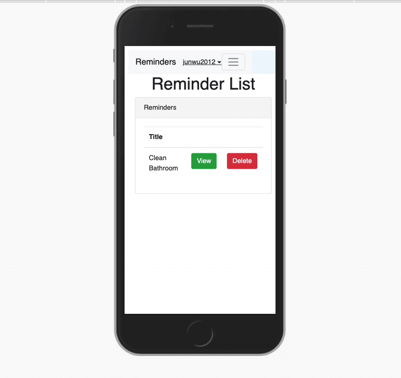

# meteor-blaze-reminders

This is a demo project using meteor ( a full stack javascript framework ) to demonstrate how to use meteor build an app to manage reminders.

## Goal 

Create a responsive mobile app allowing the user to manage their reminders.

## Tech

MeteorJS, MongoDB, BootStrap, FullCalendar

## MVP

* Users can add a reminder
* Users can have a reminders view list
* Users can update a specific reminder
* Users can delete a specific reminder
* Users can login/logout 
* Users can have a reminders view of Calendar

## Extensions

* When a reminder close to the start time, app will send a pop up window or noise to reminder user
* Users can only see their own reminders
* There should have a super user who can manage all the users

## Demo


*Demo*

## Installing / Getting started

In the project root directory, run 

```
meteor npm install

meteor 
or 
meteor --port yourport
```

open web browser type localhost:yourport/todos in url address

to see the result
